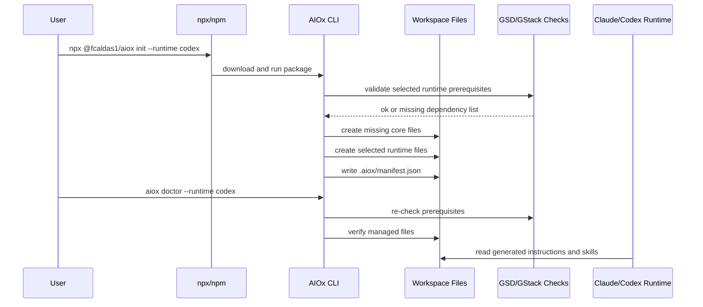

# AIOx

AIOx is a dependency-free CLI and small Node.js library for installing Tabario's agentic SDLC framework into a repository.

It creates the repo-local instruction files that Claude Code and Codex use for Tabario planning, story generation, phase execution, and QA. AIOx does not run your product, replace your agent runtime, install GSD, or install GStack. It lays down the framework files and validates that required external tools already exist.

## Quick Start

```bash
cd /path/to/your/workspace
npx @fcaldas1/aiox init --runtime codex
aiox doctor --runtime codex
```

Runtime targets:

- `claude` installs the core framework plus Claude Code commands, skills, rules, and `CLAUDE.md`.
- `codex` installs the core framework plus Codex instructions and Tabario skills.
- `both` installs all supported runtime surfaces.

## Why This Exists

Tabario uses a repeatable agentic workflow:

1. Create or resolve a Linear requirement.
2. Produce an AIOx story file.
3. Plan the work through GSD phases.
4. Run engineering review gates.
5. Execute approved phases.
6. Verify, review, commit, and sync status.

AIOx makes that workflow portable by generating the repo files that agents read before doing work.

## Install Flow



## Claude Code Complex Feature Flow

For a complex application feature, the Claude Code flow is intentionally split into specification, planning, locked execution, and review. Ralph should not start until the story and phase plans are explicit and approved.

```mermaid
sequenceDiagram
    autonumber
    participant User
    participant Claude as Claude Code
    participant AIOx as AIOx Files
    participant Linear
    participant GSD as GSD Workstream
    participant CRG as code-review-graph
    participant Review as GStack Review
    participant Repo as App Repos

    User->>Claude: /tabario-spec "new complex feature"
    Claude->>AIOx: Read CLAUDE.md and .aiox-core/*
    Claude->>Linear: Create or resolve parent requirement
    Claude->>GSD: Create/select workstream
    Claude->>AIOx: Write docs/stories/TAB-XXX-feature.md
    Claude->>Linear: Create phase sub-issues
    Claude-->>User: Report story, phases, affected repos, complexity

    alt Medium or high complexity
        User->>Claude: /plan-ceo-review
        Claude->>Review: Challenge product scope and tradeoffs
        Review-->>Claude: Accepted product changes
        Claude->>AIOx: Update story assumptions and scope
    end

    User->>Claude: /tabario-plan TAB-XXX
    Claude->>GSD: Run gsd-spec-phase for each phase
    Claude->>GSD: Run gsd-discuss-phase for each phase
    Claude->>GSD: Run gsd-plan-phase for each phase
    loop Each affected repo
        Claude->>CRG: Build/query graph with explicit --data-dir
        CRG-->>Claude: Impact radius, affected flows, risky dependencies
        Claude->>GSD: Add graph findings to phase plan
    end
    Claude->>Review: /plan-eng-review on story and phase graph
    Review-->>Claude: Architecture, data-flow, risk, and test feedback
    Claude->>AIOx: Update story with final phase graph
    Claude->>Linear: Update phase task acceptance criteria and test gates
    Claude-->>User: Report execution order and blockers

    User->>Claude: /tabario-ralph TAB-XXX
    Claude-->>User: Ask for exact approval phrase
    User->>Claude: APPROVE TAB-XXX FOR TABARIO RALPH
    Claude->>AIOx: Lock story and write Ralph state
    Claude->>Linear: Move parent and first ready phase to In Progress

    loop Sequential phase execution
        Claude->>GSD: Select next ready phase
        Claude->>CRG: Orient on repo with --repo and --data-dir
        CRG-->>Claude: Minimal context and blast radius
        Claude->>Repo: Implement phase changes
        Claude->>Repo: Run phase tests and checks
        Claude->>CRG: Refresh graph and verify blast radius
        Claude->>GSD: Mark phase complete or blocked
        Claude->>AIOx: Update story progress
        Claude->>Linear: Update phase task status
    end

    Claude->>Review: /review before completion
    Review-->>Claude: Findings or clean result
    alt Findings exist
        Claude->>Repo: Fix findings
        Claude->>Repo: Re-run tests
        Claude->>Review: Re-run /review
    end
    Claude->>Linear: Mark completed work done
    Claude-->>User: Ralph completion report
```



Primary Claude Code commands:

- `/tabario-spec`: creates or refreshes the Linear parent, GSD workstream, AIOx story, and phase sub-issues.
- `/plan-ceo-review`: optional but recommended for medium/high complexity product scope.
- `/tabario-plan`: creates executable GSD phase plans and updates the AIOx story.
- `/plan-eng-review`: mandatory engineering review before execution is considered ready.
- `/tabario-ralph`: locks the approved plan and executes phases.
- `/review`: mandatory pre-completion review gate.
- `/tabario-cancel-ralph`: cancels an active Ralph loop and records partial state.

Artifacts created or updated during the flow:

- Linear parent requirement and phase sub-issues
- `docs/stories/TAB-XXX-*.md`
- GSD workstream, phase specs, discussion notes, and phase plans
- code-review-graph context and impact findings
- `.claude/tabario-ralph.local.md` or equivalent local Ralph state while execution is active
- repo commits after verification and review

code-review-graph should be run with an explicit graph store outside the repo working tree, for example:

```bash
code-review-graph build \
  --repo /path/to/app-repo \
  --data-dir /home/you/.crg-graphs/app-repo
```

## Dependencies And Prerequisites

### Package Runtime

AIOx itself requires:

- Node.js `>=18`
- npm or another package runner capable of `npx`
- filesystem access to the target workspace

AIOx has no npm runtime dependencies. It uses only Node.js built-ins.

### Workspace Expectations

The target workspace should be a Git repository or a working project directory where agent instruction files belong.

Recommended but not installed by AIOx:

- Git, for normal repo workflows
- Linear access, if you use the Tabario issue workflow
- code-review-graph, if your generated Tabario plans require graph orientation gates
- Claude Code, when using `--runtime claude`
- Codex, when using `--runtime codex`

### External Tool Prerequisites

AIOx validates external workflow tools but never installs them.

Claude runtime requires:

- `~/.claude/skills/gstack/bin`

Codex runtime requires:

- `gsd-sdk` on `PATH`
- `$HOME/.codex/get-shit-done`

`both` requires all Claude and Codex prerequisites.

If a selected runtime is missing prerequisites, `init`, `sync`, and `upgrade` fail with explicit instructions. `doctor` reports missing prerequisites and exits non-zero.

## What It Installs

AIOx always installs the core framework:

- `.aiox-core/`
- `docs/stories/_template.md`
- `.aiox/manifest.json`

Claude runtime adds:

- `.claude/commands`
- `.claude/skills`
- `.claude/rules`
- `CLAUDE.md`

Codex runtime adds:

- `.codex/AGENTS.md`
- `.agents/skills/tabario-spec/SKILL.md`
- `.agents/skills/tabario-plan/SKILL.md`
- `.agents/skills/tabario-ralph/SKILL.md`
- `.agents/skills/tabario-cancel-ralph/SKILL.md`

## CLI

Installed command:

```bash
aiox --help
```

Commands:

```bash
aiox init --runtime <claude|codex|both> [--target <path>] [--json]
aiox sync [--runtime <claude|codex|both>] [--target <path>] [--json]
aiox doctor [--runtime <claude|codex|both>] [--target <path>] [--json]
aiox upgrade [--runtime <claude|codex|both>] [--target <path>] [--json]
```

Options:

- `--runtime, -r`: runtime target, one of `claude`, `codex`, or `both`
- `--target, -t`: workspace root to manage, defaults to the current directory
- `--json`: machine-readable output
- `--verbose, -v`: extra progress output
- `--help, -h`: command help

`init` requires `--runtime` in non-interactive shells. In an interactive terminal, AIOx prompts when `--runtime` is omitted.

`sync`, `doctor`, and `upgrade` use the runtime recorded in `.aiox/manifest.json` when `--runtime` is omitted. If no manifest exists, they default to `both`.

## Programmatic API

```js
import {
  RUNTIMES,
  doctorWorkspace,
  getFrameworkFiles,
  initWorkspace,
  syncWorkspace,
  upgradeWorkspace
} from '@fcaldas1/aiox';

await initWorkspace({
  workspaceRoot: process.cwd(),
  runtime: 'codex'
});

const files = getFrameworkFiles({ runtime: 'codex' });
```

Exported API:

- `initWorkspace(options)`
- `syncWorkspace(options)`
- `upgradeWorkspace(options)`
- `doctorWorkspace(options)`
- `getFrameworkFiles({ runtime })`
- `RUNTIMES`

## Manifest

AIOx writes `.aiox/manifest.json` with:

- package name and version
- selected runtime
- generated target groups
- managed file paths
- file hashes
- whether each file was created or adopted

The manifest is used by later `sync`, `upgrade`, and `doctor` runs.

## Safety Model

AIOx preserves existing files. If a managed file already exists, `init` and `sync` adopt it instead of overwriting it.

`upgrade` refreshes files only when AIOx previously created them and the local copy still matches the old generated content. Adopted or user-edited files are preserved.

## Local Development

```bash
cd /mnt/repos/tabario/aiox
npm run build
npm test
npm pack
```

Smoke-test a packed artifact:

```bash
tmpdir="$(mktemp -d)"
npx ./fcaldas1-aiox-0.1.0.tgz init --runtime codex --target "$tmpdir"
```

The smoke test requires the selected runtime prerequisites.

## Publishing

The package is published as:

```bash
npm install @fcaldas1/aiox
npx @fcaldas1/aiox init --runtime codex
```

The unscoped `aiox` name was rejected by npm as too similar to existing packages. The `@tabario` scope was not available to the publishing account, so the first public package uses the `@fcaldas1` scope.
